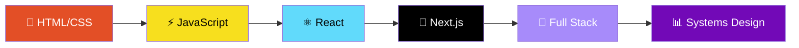

<div align="center">

<!-- Animated Header -->


<!-- Typing Animation -->
<a href="https://git.io/typing-svg"></a>

<!-- Stats Section -->
<br>
<div>
  
  
  
</div>


</div>

---

<!-- About Me Section with Cool Styling -->
<div align="center">

## 🧑‍💻 About Me

<table>
<tr>
<td width="60%">

```javascript
const ibrahim = {
    pronouns: "he" | "him",
    location: "Indonesia 🇮🇩",
    currentFocus: "DigiTech.id 🚀",
    experience: "1+ Years",
    dream: "Google Fullstack Developer 🎯",
    funFact: "Inspired by Mark Zuckerberg's casual style 👕"
};
```

</td>
<td width="40%">


</td>
</tr>
</table>

</div>

### 📋 Quick Facts

- 🔭 Currently building **DigiTech.id** - A technology solutions platform that empowers businesses
- 🌱 Continuously learning **JavaScript**, **Data Structures**, **Algorithms**, and **DevOps**
- 👯 Open to collaborate on innovative **Web Development & Full Stack Projects**
- 🤝 Seeking mentorship in **Node.js**, **Backend**, and **System Design**
- 💬 Ask me anything about my **Developer Journey** and **Web Development**
- ⚡ Passionate: Integrating technology into family businesses and creating digital solutions
- 📈 Goal: Build products that impact millions of users


---

## 🎯 What I Do

<div align="center">

<table>
<tr>
<td align="center" width="33%">


### 🎨 Frontend Development

Crafting beautiful, responsive interfaces that users love with modern frameworks like React & Next.js

</td>
<td align="center" width="33%">


### ⚙️ Backend Development

Building scalable server-side applications with Laravel, databases, and APIs

</td>
<td align="center" width="33%">


### 🎨 UI/UX Design

Designing intuitive user experiences that blend aesthetics with functionality

</td>
</tr>
</table>

</div>

---

## 🚀 Currently Working On

<div align="center">

```
╔══════════════════════════════════════════════════════════════╗
║                                                              ║
║   🌐 DigiTech.id - Technology Solutions Platform             ║
║      Empowering businesses with cutting-edge tech            ║
║                                                              ║
║   📚 Mastering Advanced JavaScript & Node.js                 ║
║      Improving backend and system design skills             ║
║                                                              ║
║   🎨 Building Stunning Portfolio Projects                    ║
║      Showcasing real-world problem-solving abilities        ║
║                                                              ║
║   🤝 Open for Freelance & Collaboration                      ║
║      Let's create something amazing together!               ║
║                                                              ║
╚══════════════════════════════════════════════════════════════╝
```

</div>

---

## 🛠️ Tech Arsenal

<div align="center">

> **My technology toolkit spans multiple domains** 🎯

### 👨‍💻 Programming Languages


### ⚡ Frameworks & Libraries


### 🛠️ Tools & Platforms


### 🎨 Design & Creative Tools


</div>

---

## ⚡ Expertise & Proficiency

<div align="center">

| Category | Skills | Proficiency |
|----------|--------|------------|
| 🎨 **Frontend** | React, Next.js, TailwindCSS, HTML/CSS | ████████░░ 90% |
| ⚙️ **Backend** | Node.js, Express, PHP, APIs | ███████░░░ 70% |
| 🗄️ **Databases** | MySQL, Supabase, Firebase,Postgresql | ███████░░░ 70% |
| 🛠️ **Tools** | Git, Docker, VS Code, Figma | █████████░ 90% |
| 📱 **Responsive Design** | Mobile-First, Web Development | █████████░ 90% |

</div>

---

## 🎓 Learning Journey

<div align="center">


```mermaid
graph LR
    A[🌱 HTML/CSS] --> B[⚡ JavaScript]
    B --> C[⚛️ React]
    C --> D[🚀 Next.js]
    D --> E[🎯 Full Stack]
    E --> F[📊 Systems Design]
    
    style A fill:#E34F26,color:#fff
    style B fill:#F7DF1E,color:#000
    style C fill:#61DAFB,color:#000
    style D fill:#000,color:#fff
    style E fill:#A78BFA,color:#fff
    style F fill:#7209B7,color:#fff
```

</div>

---

## 💡 Featured Projects

<div align="center">

| # | Project | Description | Tech Stack | Status |
|---|---------|-------------|------------|--------|
| 🏆 | **DigiTech.id** | Technology Solutions Platform for digital transformation | Next.js, TailwindCSS, Node.js | 🚀 Active |
| 🏠 | **Simkost** | Comprehensive boarding house management system | Laravel, MySQL, Vue.js | ✅ Completed |
| 🏣 | **K-mate** | Building materials inventory & management system | Vue.js, TailwindCSS, Golang | ✅ Completed |

</div>

---

## 🌐 Connect With Me

<div align="center">

> **Let's build amazing things together!** 💫

<a href="https://discord.gg/Ibrahim Bahaly">
  
</a>
<a href="https://instagram.com/ibrabahaly">
  
</a>
<a href="https://linkedin.com/in/Ibrahim Bahaly">
  
</a>
<a href="https://medium.com/@Ibrahim Bahaly">
  
</a>
<a href="https://pinterest.com/ibrahim">
  
</a>
<a href="https://tiktok.com/@Ibrabramss">
  
</a>

</div>

---

## 🎮 Outside of Coding

<div align="center">


<br><br>

When I'm not coding, you can find me:
- 🎮 Gaming on Xbox | Playing competitive games & exploring new worlds
- 🎵 Listening to music | Music fuels my coding sessions
- 📚 Reading tech articles & staying updated with industry trends
- 🏃 Staying active & maintaining work-life balance

<br>


</div>

---

## 💭 Random Dev Quote

<div align="center">


</div>

---

## � Let's Build Something Amazing Together!

<div align="center">


<br><br>

### ✨ Open for Opportunities ✨

I'm actively looking for:
- 💻 **Freelance Projects** - Web development, full-stack solutions
- 🤝 **Collaborations** - Open source contributions & team projects
- 📧 **Partnerships** - Building innovative digital solutions together
- 🚀 **Opportunities** - Full-time roles & exciting startups

### 📧 Get in Touch

[](mailto:ibrahim@digitech.id)
[](#)

</div>

---

---

<div align="center">

### 🎓 Always Learning, Always Growing


<br>


</div>

---

<div align="center">

### 🎁 Thanks for Visiting!


**Made with ❤️ by Ibrahim Bahaly**

<a href="https://github.com/ibraiiian">
  
</a>

⭐ If you liked this profile, consider starring my repositories!

</div>
