<div align="center">

<!-- Animated Header -->


<!-- Typing Animation -->
<a href="https://git.io/typing-svg"></a>

<!-- Profile Views Counter -->
<br>


</div>

---

<!-- About Me Section with Cool Styling -->


## 🧑‍💻 About Me

```javascript
const ibrahim = {
    pronouns: "he" | "him",
    location: "Indonesia 🇮🇩",
    currentFocus: "DigiTech.id 🚀",
    dream: "Google Fullstack Developer 🎯",
    funFact: "Inspired by Mark Zuckerberg's casual style 👕"
};
```

- 🔭 Currently building **DigiTech.id** - A tech solutions platform
- 🌱 Learning **JavaScript**, **Data Structures** & **Algorithms**
- 👯 Open to collaborate on **Web Development Projects**
- 🤝 Looking for help with **Node.js** & **Backend Technologies**
- 💬 Ask me about my journey as a **Junior Web Developer**
- ⚡ I integrate technology into **family businesses**

<br clear="right"/>

---

## 🎯 What I Do

<div align="center">

<table>
<tr>
<td align="center" width="33%">


**Frontend Development**

Building beautiful & responsive user interfaces

</td>
<td align="center" width="33%">


**Backend Development**

Creating robust server-side applications

</td>
<td align="center" width="33%">


**UI/UX Design**

Designing intuitive user experiences

</td>
</tr>
</table>

</div>

---

## 🚀 Currently Working On

<div align="center">

```
╔══════════════════════════════════════════════════════════════╗
║                                                              ║
║   🌐 DigiTech.id - Technology Solutions Platform             ║
║   📚 Learning Advanced JavaScript & Node.js                  ║
║   🎨 Building Portfolio Projects                             ║
║   🤝 Open for Freelance Web Development                      ║
║                                                              ║
╚══════════════════════════════════════════════════════════════╝
```

</div>

---

## 🛠️ Tech Arsenal

<div align="center">

### 👨‍💻 Languages


### ⚡ Frameworks & Libraries


### 🛠️ Tools & Platforms


### 🎨 Design


</div>

---

## 🎓 Learning Journey

```mermaid
graph LR
    A[🌱 HTML/CSS] --> B[⚡ JavaScript]
    B --> C[⚛️ React]
    C --> D[🚀 Next.js]
    D --> E[🎯 Full Stack]
    
    style A fill:#E34F26,color:#fff
    style B fill:#F7DF1E,color:#000
    style C fill:#61DAFB,color:#000
    style D fill:#000,color:#fff
    style E fill:#A78BFA,color:#fff
```

<div align="center">



</div>

---

## 💡 Featured Projects

<div align="center">

| Project | Description | Tech Stack |
|---------|-------------|------------|
| 🌐 **DigiTech.id** | Technology Solutions Platform | Next.js, TailwindCSS |
| 🏠 **Simkost** | Boarding House Management System | PHP, MySQL |
| 📚 **Simperpus** | Library Management System | PHP, TailwindCSS |
| 💰 **Sistem Kasir** | Point of Sale System | PHP, Bootstrap |

</div>

---

## 🌐 Connect With Me

<div align="center">

<a href="https://discord.gg/Ibrahim Bahaly">
  
</a>
<a href="https://instagram.com/ibrabahaly">
  
</a>
<a href="https://linkedin.com/in/Ibrahim Bahaly">
  
</a>
<a href="https://medium.com/@Ibrahim Bahaly">
  
</a>
<a href="https://pinterest.com/ibrahim">
  
</a>
<a href="https://tiktok.com/@Ibrabramss">
  
</a>

</div>

---

## 🎮 When I'm Not Coding

<div align="center">


<br><br>


</div>

---

## 💭 Random Dev Quote

<div align="center">


</div>

---

## � Let's Build Something Amazing Together!

<div align="center">


<br><br>

**💼 Open for Freelance Projects & Collaborations**

[](mailto:your.email@gmail.com)

</div>

---

<div align="center">

### ✨ Thanks for visiting! Have a great day! ✨


</div>
